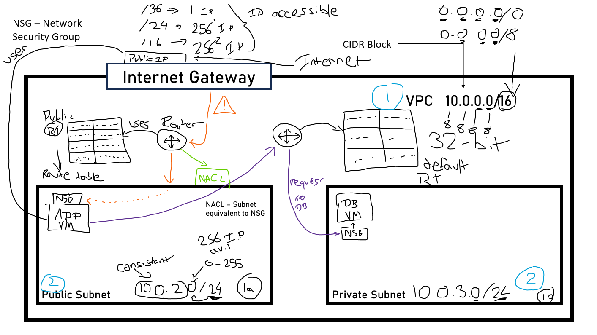

# VCP - Virtual Private Cloud
## Diagram reference of VCP:

### What is VCP?
- VCP is a virtual private cloud that acts similarly to a VPN (Virtual Private Network) that you can operate in your own datacenter, this provides security and protection as your data is stored away from public use. With a VCP, you can add in Subnets

### What are subnets?
- Subnets are a range of IP addresses within your VCP, tht resides within a single availability zone. You can set your subnet to private or public depending on if you want the subnet accessed through the internet or internally.

### How does IP addressing work?

- When it comes to IP addresses you can assign ranges to your VCP and subnets, the format follows 0.0.0.0/0
