# Guide on how to create a VCP.


### Creating a VPC 
- Search VPC in search bar
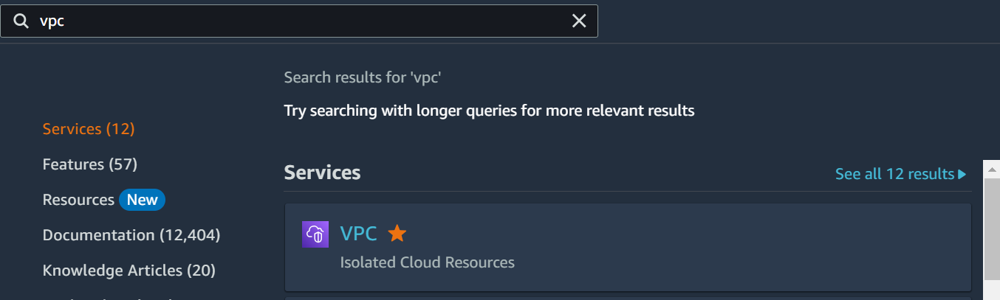
- Select Your VPCs in navigation bar
- Create VPC
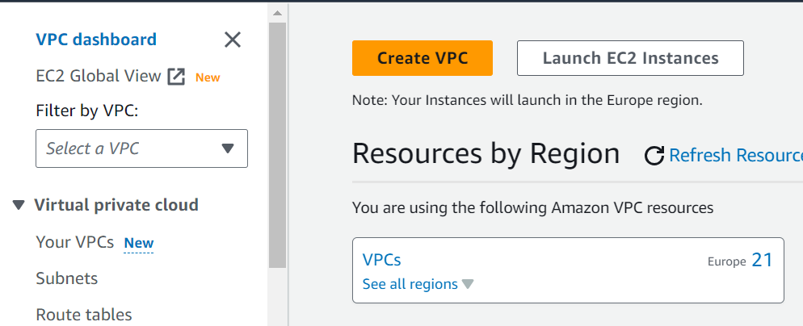
- VPC only
- Name tag - tech254-lukew-2tier-first-vpc
  - 2tier refers to two tier architecture system
- IPv4 CIDR - 10.0.0.0/16
- No IPv6 CIDR block
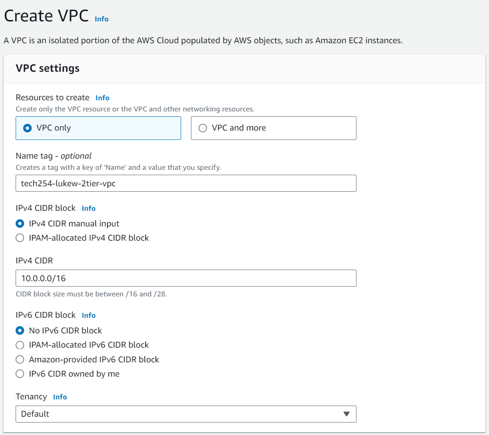
- Create VPC

### Creating Subnets
- On navigation go to Subnet
- Create Subnet
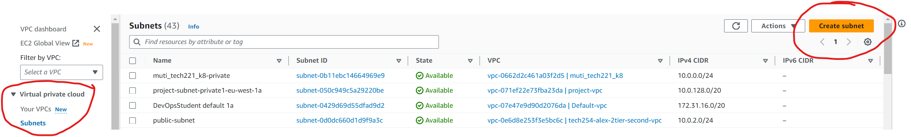
- Search for VPC and select
- Subnet name - public-subnet (don't need naming convention)
- Availability Zone - eu-west-1a
  - Choose the zone in which your subnet will reside, or let Amazon choose one for you.
- IPv4 subnet CIDR block - 10.0.2.0/24
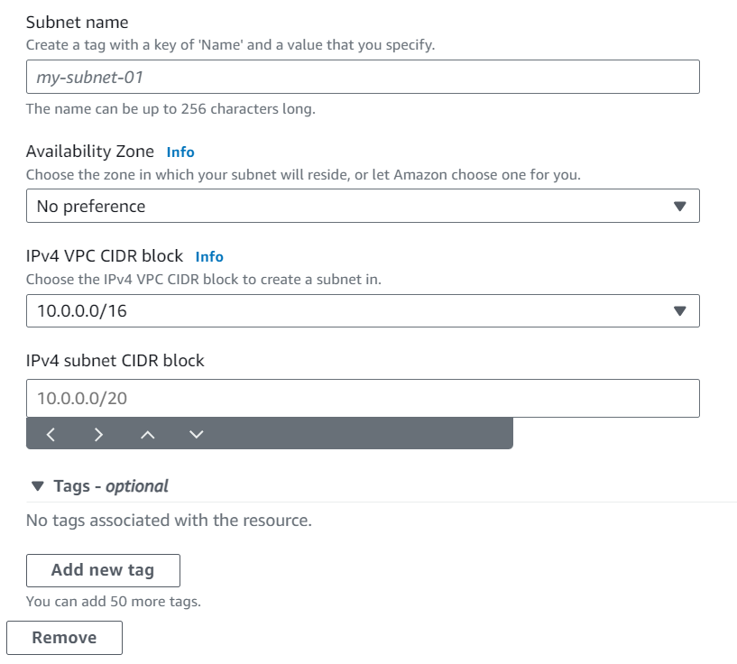
- Add new subnet 
- Subnet name - private-subnet
- Availability Zone - eu-west-1b
- IPv4 subnet CIDR block - 10.0.3.0/24

- Create subnet

### Create Internet gateway
- On navigation go to internet gateway
- create internet gateway
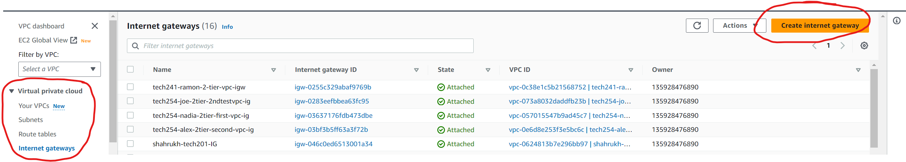
- name tag - tech254-lukew-2tier-first-vcp-ig
- Create internet gateway
- Actions 
- Attach to VPC
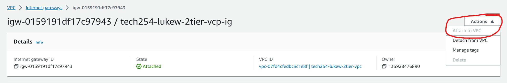
- Search for your VPC
- Attach internet gateway

### Create public route table
- On the navigation bar go to route tables
- Create route table
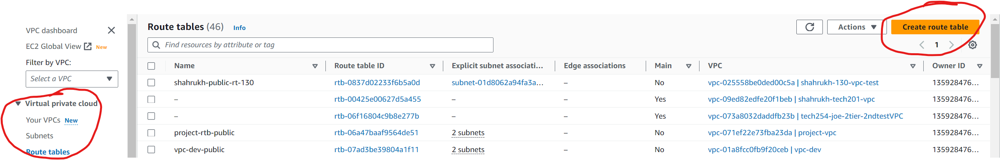
- Name - public route table (Don't need naming convention)
- Select your VPC to connect with.
- Create route table

### Associate the route table to Subnet
- In your route table details go to subnet associations
- Explicit subnet associations
- Edit subnet associations
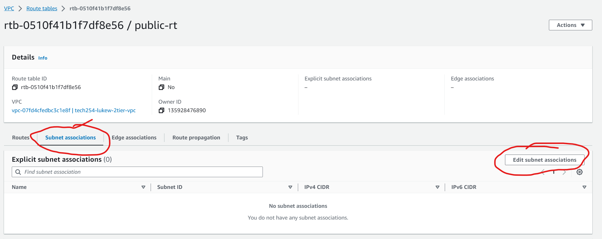
- Select public-subnet
- Save associations

### Add Internet Gateway to route
- Switch to route tab in route table
- Select edit route
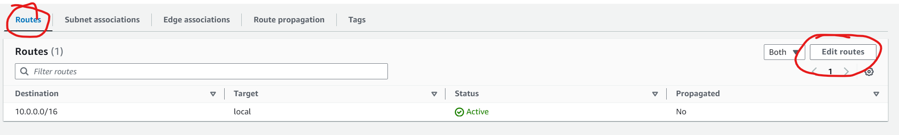
- Add route
- Destination - 0.0.0.0/0
- Target - Internet Gateway - Your VPC
- Save changes

### Checking connections
- In navigation bar go to Your VPCs
- Select VPC ID on Your VPC
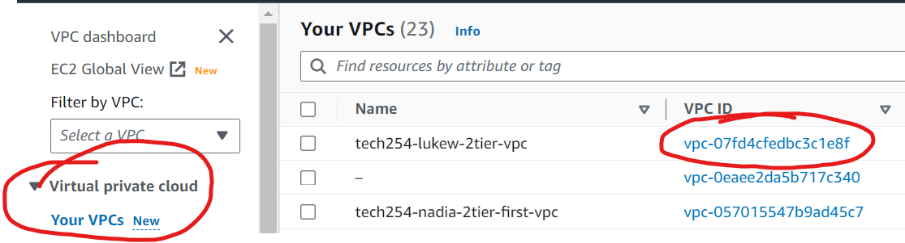
- Go to Resource map to check the connections
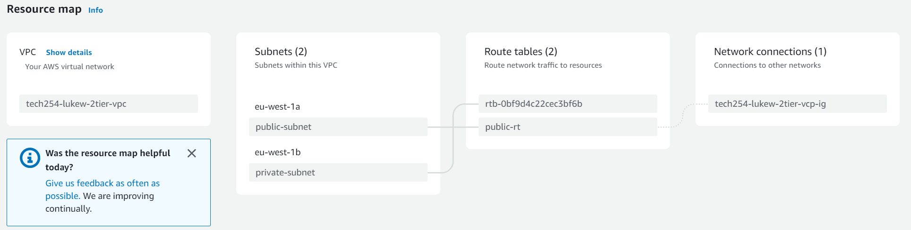

### Setting up the DB virtual machine
- Go to EC2
- on navigation bar go to Images, AMIs
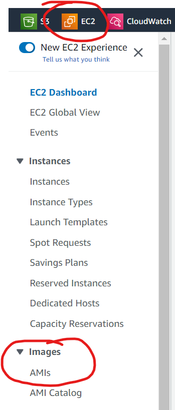
- Search for db image
- Select images
- Launch instance from AMI
- Name - tech254-lukew-db-test-first-vpc
- Key pair - tech254
- Network settings
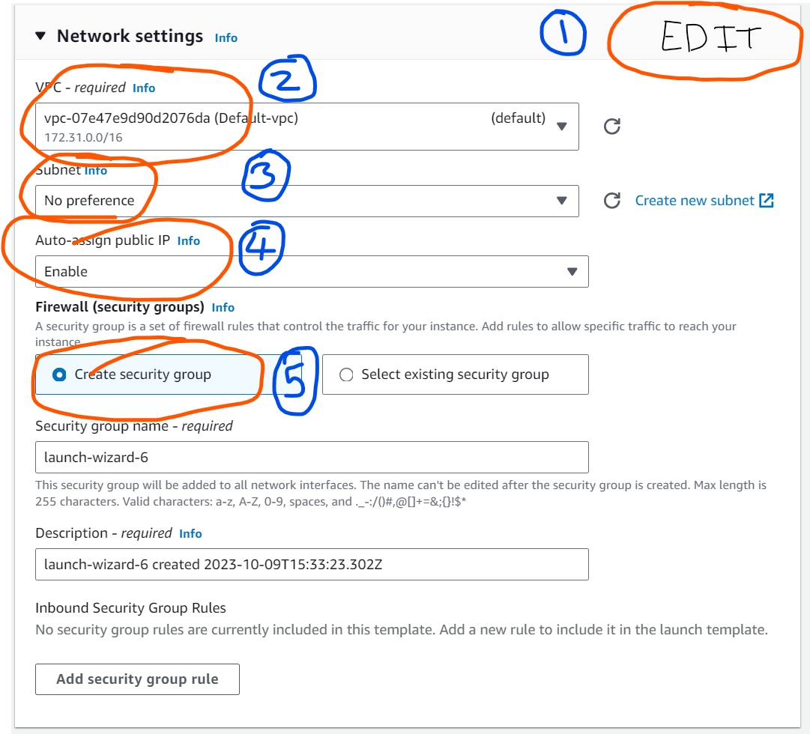
  1. Edit
  2. VPC - select VPC
  3. subnet - private-subnet
  4. Auto-assign public IP - Disable
  5. security group
    - associated with particular vpc
    - create new security group
    - name - tech254-lukew-db-test-first-vpc-sg-ssh-mongo
    - inbound - ssh, mongo (27017)
- Launch instance

### Setting up app virtual machine
- Go to EC2
- on navigation bar go to Images, AMIs
- Search for app image
- Select images
- Launch instance from AMI
- Name - tech254-lukew-app-test-first-vpc
- Key pair - tech254
- Network settings

  1. Edit
  2. VPC - select VPC
  3. subnet - public-subnet
  4. Auto-assign public IP - Enable
  5. security group
    - associated with particular vpc
    - create new security group
    - name - tech254-lukew-app-test-first-vpc-sg-ssh-http-3000
    - inbound - ssh, http, nodejs app (3000)
- Advance details
  - User data
```
#!/bin/bash

# IP address of the db, this will be a private IP
export DB_HOST=mongodb://34.247.106.99:27017/posts

cd /home/ubuntu/repo/app
sudo systemctl restart nginx
npm install

node seeds/seed.js

sudo npm install pm2 -g
pm2 kill
pm2 start app.js
```
- Launch instance

### deleting everything
- Instances
  - Select instances
  - actions
  - terminate instances
- Unwanted AMI
  - Go to AMIs
  - Select AMI to delete
  - actions 
  - deregister
  - save snapshot
  - go to snapshots
  - delete snapshots
- Security group
  - navigation bar, network and security, security groups
  - select security group
  - actions
  - delete
  - type delete
  - delete
- Delete VPC
  - Go to VPC
  - navigation bar, VPC, Your VPC
  - select VPC
  - actions
  - Select VPC
  - type delete
  - Delete
